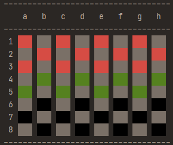

A Python3 library that you can use to play a game of checkers/draughts. This is just a set of classes that you can use in your code, it's not an interactive shell checkersgame.

#Note:
This is a modified version of the [Imparaai checkers library](https://github.com/ImparaAI/checkers).
Alongside the base module (which I forked from the repository at the above link), the Colorama and PrettyTable dependencies are also in use.
The only addition I have made to this module is a graphical representation of the board.
# Assumptions

The rules used are for competitive American checkers or English draughts. This means an 8x8 board with **force captures** and regular kings.

Each position on the board is numbered 1 to 32. Each move is represented as an array with two values: starting position and ending position. So if you're starting a new game, one of the available moves is `[9, 13]` for player 1. If there's a capture move, the ending position is the position the capturing piece will land on (i.e. two rows from its original row), which might look like `[13, 22]`.

Each piece movement is completely distinct, even if the move is part of a multiple capture series. In [Portable Draughts Notation](https://en.wikipedia.org/wiki/Portable_Draughts_Notation) mutli-capture series are usually represented by a `5-32` (for a particularly long series of jumps), but in certain situations there could be multiple pathways to achieve that final position. This game requires an explicit spelling out of each distinct move in the multi-capture series.

# Usage

Create a new game:

```python
from checkers.game import Game

game = Game()
```

See whose turn it is:

```python
game.whose_turn() #1 or 2
```

Get the possible moves:

```python
game.get_possible_moves() #[[9, 13], [9, 14], [10, 14], [10, 15], [11, 15], [11, 16], [12, 16]]
```

Make a move:

```python
game.move([9, 13])
```

Check if the game is over:

```python
game.is_over() #True or False
```

Find out who won:

```python
game.get_winner() #None or 1 or 2
```

Review the move history:

```python
game.moves #[[int, int], [int, int], ...]
```

Change the consecutive noncapture move limit (default `40` according to the [rules](http://www.usacheckers.com/rulesofcheckers.php)):

```python
game.consecutive_noncapture_move_limit = 20
game.move_limit_reached() #True or False
```

Review the pieces on the board:

```python
for piece in game.board.pieces:
	piece.player #1 or 2
	piece.other_player #1 or 2
	piece.king #True or False
	piece.captured #True or False
	piece.position #1-32
	piece.get_possible_capture_moves() #[[int, int], [int, int], ...]
	piece.get_possible_positional_moves() #[[int, int], [int, int], ...]
```

Get a string representation of the pieces on the board:


```python
str(game.board)
```
Output:




# Testing

Run `python3 -m unittest discover` from the root.